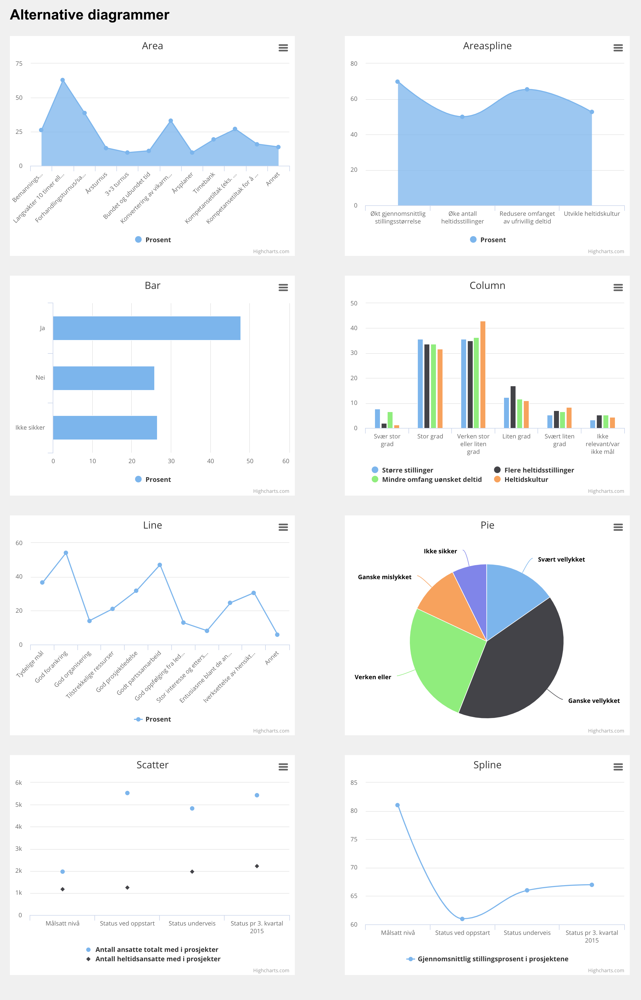

# Highcharts Module for [Hogan](https://github.com/dekodeinteraktiv/hogan-core)




## Prerequisite
* ACF Pro
* [Hogan Core](https://github.com/dekodeinteraktiv/hogan-core)

## Installation
Downloading this repository and place it in `wp-content/plugins`

## Avalable filters

`hogan/module/highcharts/color_scheme` Add/replace color schemes.

Example:

```php
add_filter( 'hogan/module/highcharts/color_scheme', function( $color_schemes ) {

	$color_schemes['my_color_scheme'] = '#7cb5ec, #434348, #90ed7d, #f7a35c, #8085e9, #f15c80, #e4d354, #2b908f, #f45b5b, #91e8e1';

	return $color_schemes;

} );
```

## Changelog

0.0.3

* Add the following chart types: Area, Area spline, Bar, Line, Pie, Scatter and Spline
* Add color schemes.

0.0.2

* Initial release with Column chart type.


## Credits

[Color Scheme Field for Advanced Custom Fields PRO](https://wordpress.org/plugins/color-scheme-field-for-advanced-custom-fields-pro/) by By Hugo Moran.

## Copyright and License

Highcharts Module for Hogan is copyright 2019 Per Soderlind

Highcharts Module for Hogan is free software: you can redistribute it and/or modify it under the terms of the GNU General Public License as published by the Free Software Foundation, either version 2 of the License, or (at your option) any later version.

Highcharts Module for Hogan is distributed in the hope that it will be useful, but WITHOUT ANY WARRANTY; without even the implied warranty of MERCHANTABILITY or FITNESS FOR A PARTICULAR PURPOSE. See the GNU General Public License for more details.

You should have received a copy of the GNU Lesser General Public License along with the Extension. If not, see http://www.gnu.org/licenses/.
